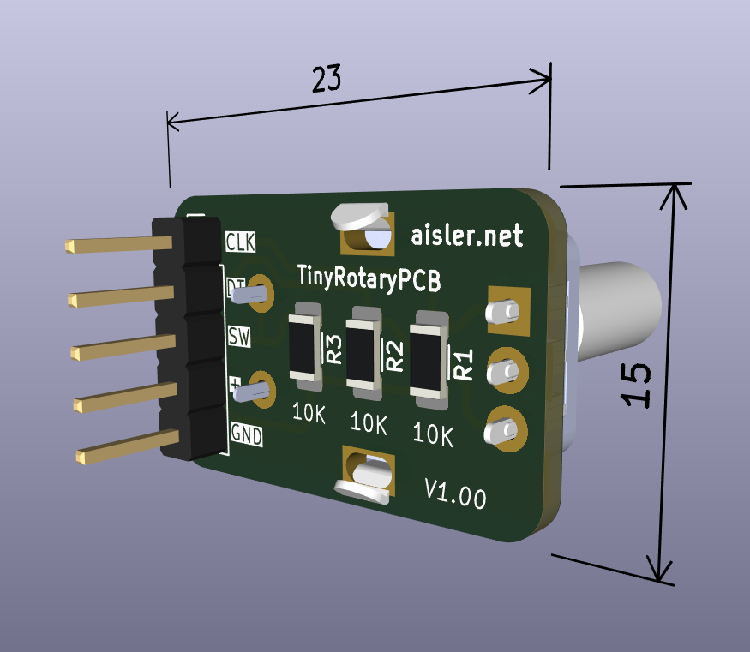
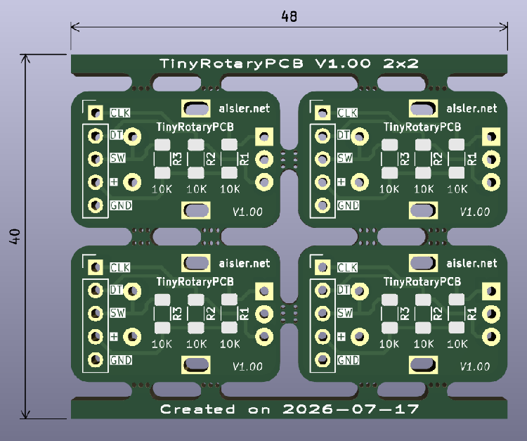

<picture>
    
</picture>

# TinyRotaryPCB

A tiny PCB (with surface resistors) for the BOURNS PEC11R rotary encoder.

## Printed Circuit Board (PCB) :

As part of an educational project, the schematic and PCB are made with [KiCad](https://www.kicad.org) version 9 ([kicad](kicad/) folder).

:bulb: All important parameters are stored in the schematic/PCB editors **text variables** (common project variables).

The TinyRotaryPCB itself with the rotary encoder (in reverse side for panel mount), dimensions (mm) :



The panelization option (2x2 boards with stencil) was generated with the KiCad plugin [KiKit](https://github.com/yaqwsx/KiKit), dimensions (mm) in [kicad/panel](kicad/panel/) folder :



Thanks to [AISLER](https://aisler.net) PCB manufacturer :eu:

Other useful plugins for KiCad :
* AISLER Push for KiCad : https://github.com/aislerhq (with AISLER repository to always get the latest updates)
* Interactive HTML BOM : https://github.com/openscopeproject/InteractiveHtmlBom
* Board2Pdf : https://gitlab.com/dennevi/Board2Pdf
* Solarized Dark Theme : https://github.com/pointhi/kicad-color-schemes

The shell script to easily generate panels (in [kicad](kicad/) folder)… :laughing:

```shell
#!/bin/bash
# TinyRotaryPCB with KiCad and KiKit plugin for PCB panelization
# GitHub project : https://github.com/Mick3DIY/TinyRotaryPCB
# KiCad documentation : https://www.kicad.org
# KiKit plugin documentation : https://github.com/yaqwsx/KiKit

# Input and output files
INPUT_FILE="TinyRotaryPCB.kicad_pcb"
OUTPUT_DIR="panel"
OUTPUT_FILE="${OUTPUT_DIR}/TinyRotaryPCB_panel.kicad_pcb"

# Layout parameters, by default 2x2 -> panelize.sh <rows> <cols> parameters
LAYOUT_ROWS="${1:-2}"
LAYOUT_COLS="${2:-2}"
LAYOUT_SPACE="2mm"

# Tab parameters
TAB_TYPE="fixed"
TAB_HWIDTH="2mm"
TAB_VWIDTH="2mm"
TAB_VCOUNT="2"

# Cuts parameters
CUTS="mousebites; drill: 0.5mm; spacing: 0.75mm; offset: -0.3mm; prolong: 0.5mm"

# Framing parameters
FRAME_TYPE="railstb"
FRAME_WIDTH="2mm"
FRAME_SPACE="2mm"

# Text parameters
TEXT_HEIGHT="0.8mm"
TEXT_VOFFSET_POS="1mm"
TEXT_VOFFSET_NEG="-1mm"
TEXT_JUSTIFY="hjustify: center; vjustify: center;"
POST_MILLRADIUS="1mm"

# Ensure output directory exist
mkdir -p "${OUTPUT_DIR}"

# Kikit command with all parameters
kikit panelize \
    --layout "grid; rows: ${LAYOUT_ROWS}; cols: ${LAYOUT_COLS}; space: ${LAYOUT_SPACE}" \
    --tabs "${TAB_TYPE}; hwidth: ${TAB_HWIDTH}; vwidth: ${TAB_VWIDTH}; vcount: ${TAB_VCOUNT}" \
    --cuts "${CUTS}" \
    --framing "${FRAME_TYPE}; width: ${FRAME_WIDTH}; space: ${FRAME_SPACE};" \
    --text "simple; text: {boardTitle} {boardRevision} ${LAYOUT_COLS}x${LAYOUT_ROWS}; anchor: mt; voffset: ${TEXT_VOFFSET_POS}; height: ${TEXT_HEIGHT}; ${TEXT_JUSTIFY}" \
    --text2 "simple; text: Created on {boardDate}; anchor: mb; voffset: ${TEXT_VOFFSET_NEG}; height: ${TEXT_HEIGHT}; ${TEXT_JUSTIFY}" \
    --post "millradius: ${POST_MILLRADIUS}" \
    "${INPUT_FILE}" "${OUTPUT_FILE}"

# Check if the command succeeded
if [ $? -eq 0 ]; then
    echo "Panelization successful : ${OUTPUT_FILE}"
else
    echo "Error : Panelization failed"
    exit 1
fi
```

More panelization examples in KiKit plugin documentation : https://yaqwsx.github.io/KiKit/latest/panelization/examples/

## TODO :

- [ ] Add PDF file for the panelization to check dimensions, rotary encoder pads
- [ ] Add a screenshot from the logic analyser [Sigrok](https://sigrok.org/) with CLK/DT and switch signals
- [ ] Add link to the Elektor Ebook "Logic Analyzers in Practice" from Jörg Rippel :thumbsup:

## Documentation :

BOURNS PEC11R Series 12 mm incremental rotary encoder (PEC11R-4220F-S0024) :
* https://www.bourns.com/resources/rohs/encoders/contacting-encoders
* https://www.bourns.com/docs/product-datasheets/pec11r.pdf


> [!NOTE]
> Big thanks to the [KiCad](https://www.kicad.org) and plugins communities. :heart:

Happy soldering & have fun ! :partying_face:
